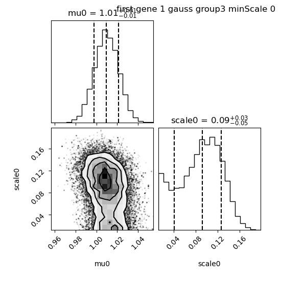
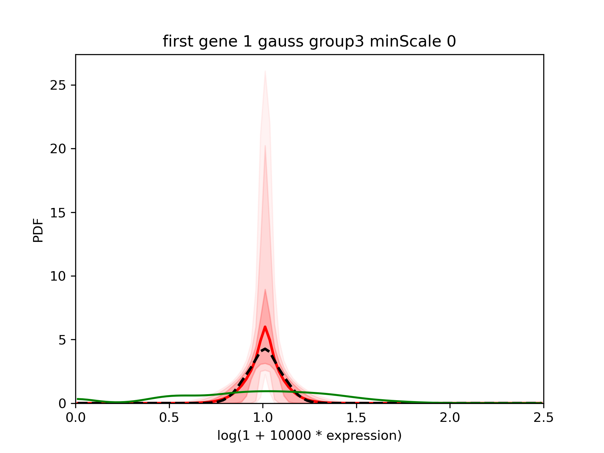
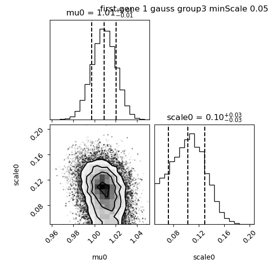
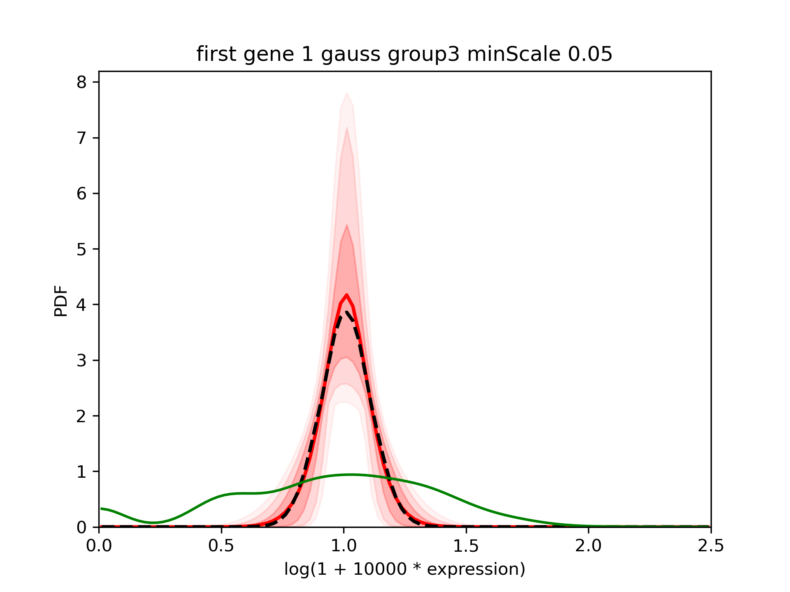

Change minScale
===============

.. contents:: 
    :local:

Inputs
------

We took total UMI counts from a real dataset of NIH3T3.
We generated a example where 2 genes have the same distribution (2 gaussians, one of mean 0.375, scale 0.125 and another one of mean 1 and scale 0.1).
Half of cells goes in each gaussian.
The gene is called "0.5_0_0_0.5_x".

minScale
--------

In our model, the prior on the scale of each Gaussian is that it must be above the ``--minScale``. By default, this value is set to 0.1 because most of the time we don't have the resolution to go below.
Here we will decrease this value to see how it affects the results

Run baredSC on the subpopulation with a scale of 0.1
----------------------------------------------------

Let's focus on cells of group 3.0 (which corresponds to the second Gaussian of mean 1 and scale 0.1).
We run baredSC but we put ``--minScale`` to 0. A minimum scale of 0 is not accepted by baredSC
because it causes some issues so setting it to 0 will put the minimum value accepted by baredSC.

.. code:: bash

    $ nnorm=1
    $ baredSC_1d \
            --input example/nih3t3_generated_2d_2.txt \
            --metadata1ColName 0.5_0_0_0.5_group \
            --metadata1Values 3.0 \
            --geneColName 0.5_0_0_0.5_x \
            --output example/first_example_1d_group3_${nnorm}gauss_ms0 \
            --nnorm ${nnorm} --minScale 0 \
            --minNeff 200 \
            --figure example/first_example_1d_group3_${nnorm}gauss_ms0.png \
            --title "first gene ${nnorm} gauss group3 minScale 0"

First let's have a look to the corner plot:

We see that the median value for scale0 is 0.09 so very close to what was simulated.
However, we also see some very small values of scale. As a consequence, when we look at the results:

We see that the confidence interval is quite large and that the mean (red) is far from the median (dashed black).

In such cases, it is reasonable to use a value for the minimum scale intermediate between the minimum value accepted by baredSC (0.0125) and the default value (0.1).
For example, we can use 0.05:

.. code:: bash

    $ nnorm=1
    $ baredSC_1d \
        --input example/nih3t3_generated_2d_2.txt \
        --metadata1ColName 0.5_0_0_0.5_group \
        --metadata1Values 3.0 \
        --geneColName 0.5_0_0_0.5_x \
        --output example/first_example_1d_group3_${nnorm}gauss_ms0.05 \
        --nnorm ${nnorm} --minScale 0.05 \
        --minNeff 200 \
        --figure example/first_example_1d_group3_${nnorm}gauss_ms0.05.png \
        --title "first gene ${nnorm} gauss group3 minScale 0.05"

The corner plot shows that the median is still close to 0.1:

We see that the confidence interval is reduced large and that the mean (red) is closer from the median (dashed black).

