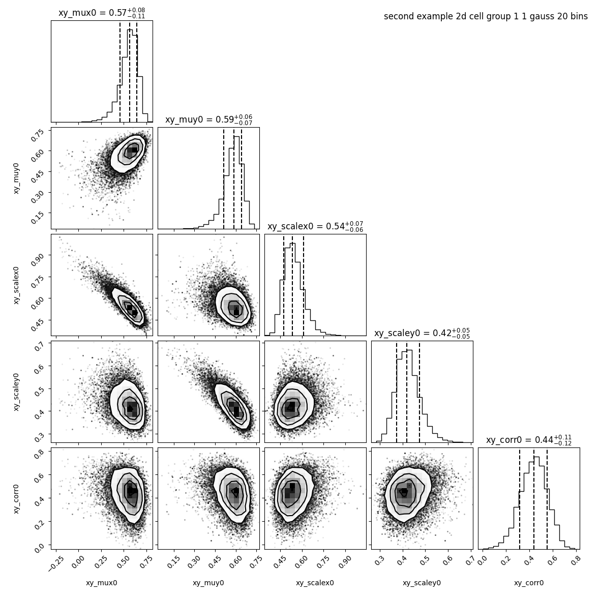

Change the number of bins
=========================

.. contents:: 
    :local:

baredSC can be relatively slow. A way to speed it is to decrease the number of bins.

Inputs
------

We took total UMI counts from a real dataset of NIH3T3.
We generated a example where the PDF of the 2 genes is a 2D Gaussian.
The mean on each axis and the scale on each axis is equal to 0.5 and the correlation value is also 0.5.
The input table can be downloaded from `here <https://raw.githubusercontent.com/lldelisle/baredSC/master/example/nih3t3_generated_second.txt>`_.

Run baredSC in 2D
-----------------

By default baredSC_2d uses 50 bins in x and 50 bins in y. Let's run with default parameters.

..
  python ~/mnt/home_scitas/softwares/scriptsForLopezDelisleEtAl2021/scripts/generate_2dgauss_data_columns.py --input ~/mnt/scratch/LopezDelisle2021/output1/nih3t3_nRNA.txt --colnames 1_0.5_0.5_0.5_0.5_0.5 > example/nih3t3_generated_second.txt

.. code:: bash

    $ nnorm=1
    $ baredSC_2d \
        --input example/nih3t3_generated_second.txt \
        --geneXColName 1_0.5_0.5_0.5_0.5_0.5_x \
        --geneYColName 1_0.5_0.5_0.5_0.5_0.5_y \
        --metadata1ColName group \
        --metadata1Values group1 \
        --output example/second_example_2d_cellgroup1_${nnorm}gauss \
        --nnorm ${nnorm} \
        --figure example/second_example_2d_cellgroup1_${nnorm}gauss.png \
        --title "second example 2d cell group 1 ${nnorm} gauss"

It took 11 minutes to run the MCMC and 3 minutes to compute the PDF.

Let's try to reduce the number of bins using ``--nx`` and ``--ny``:

.. code:: bash

    $ nnorm=1
    $ baredSC_2d \
        --input example/nih3t3_generated_second.txt \
        --geneXColName 1_0.5_0.5_0.5_0.5_0.5_x \
        --geneYColName 1_0.5_0.5_0.5_0.5_0.5_y \
        --metadata1ColName group \
        --metadata1Values group1 \
        --output example/second_example_2d_cellgroup1_${nnorm}gauss_nx20 \
        --nnorm ${nnorm} \
        --nx 20 --ny 20 \
        --figure example/second_example_2d_cellgroup1_${nnorm}gauss_nx20.png \
        --title "second example 2d cell group 1 ${nnorm} gauss 20 bins"

This time it took 3:32 minutes to compute MCMC and 30 seconds to get the PDF.

The parameters found are the same:

.. image:: ../../../example/second_example_2d_cellgroup1_1gauss_corner.png
    :width: 48 %

However, the image provided with 20 bins is much more pixelized:

There is a way to render the plot prettier. However,
you need to keep in mind that these pretty plots will not display the data
as they have been used to compute the likelihood.
In this example, the scale of the Gaussian is large enough that's why it gave the same results with both number of bins.
We can set the number of bins to use in the plot with ``--prettyBinsx`` and ``--prettyBinsy``.

.. code:: bash

    $ nnorm=1
    $ baredSC_2d \
        --input example/nih3t3_generated_second.txt \
        --geneXColName 1_0.5_0.5_0.5_0.5_0.5_x \
        --geneYColName 1_0.5_0.5_0.5_0.5_0.5_y \
        --metadata1ColName group \
        --metadata1Values group1 \
        --output example/second_example_2d_cellgroup1_${nnorm}gauss_nx20 \
        --nnorm ${nnorm} \
        --nx 20 --ny 20 --prettyBinsx 50 --prettyBinsy 50 \
        --figure example/second_example_2d_cellgroup1_${nnorm}gauss_nx20_pretty.png \
        --title "second example 2d cell group 1 ${nnorm} gauss 20 bins pretty"

It will use the ``.npz`` file generated with the last run to get the MCMC results.

Now they really look alike.

These options also exists in 1D.
