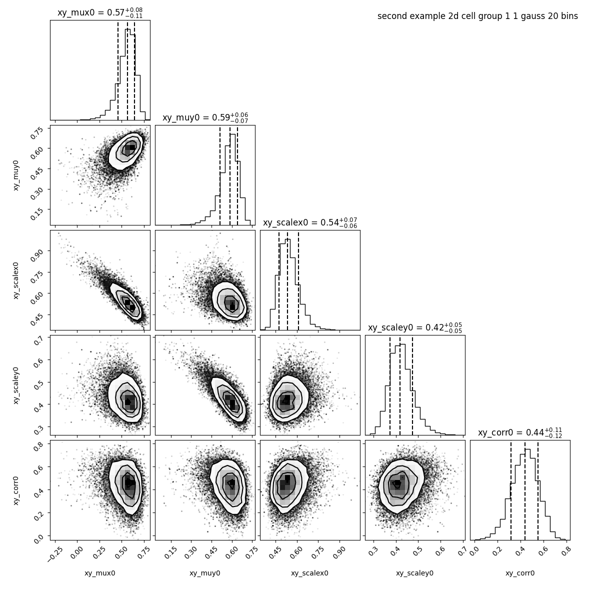
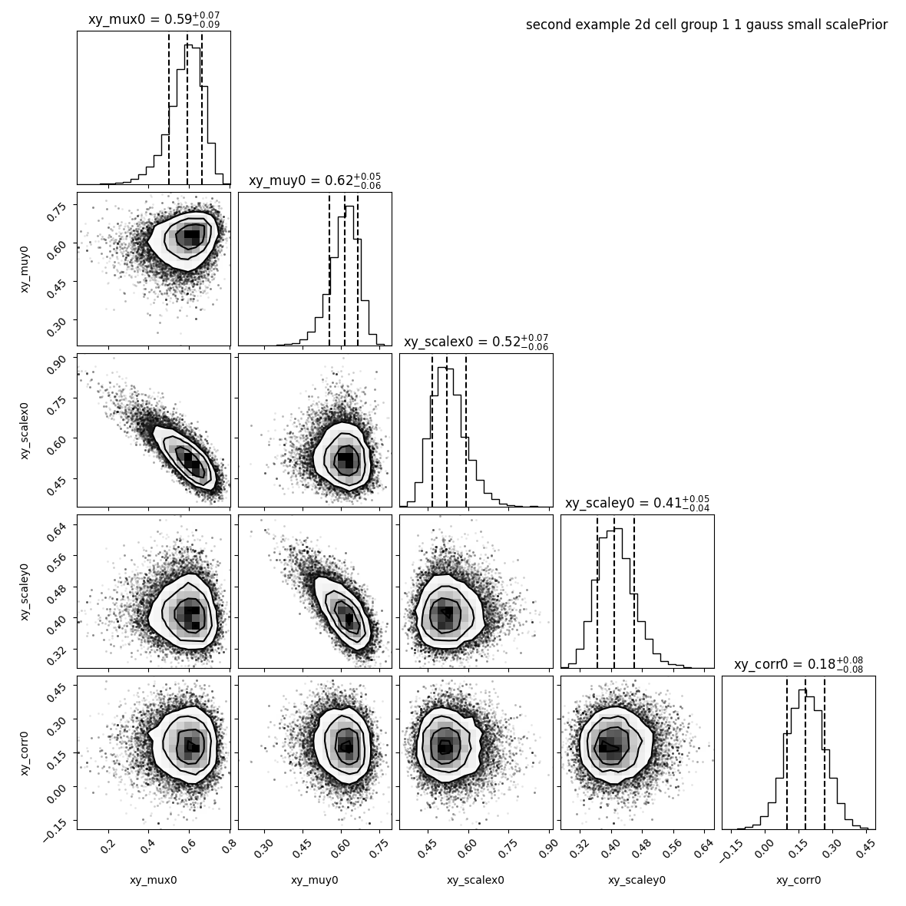
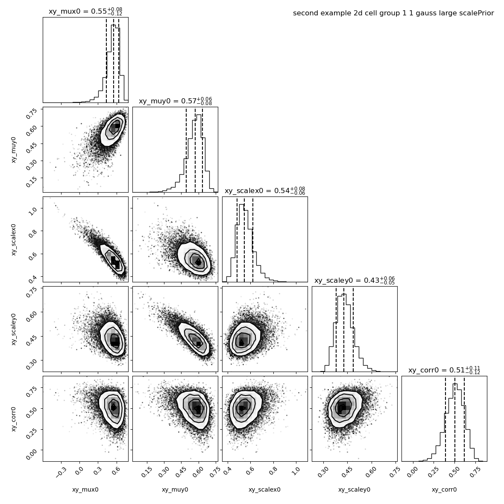

Change scalePrior
=================

.. contents:: 
    :local:

baredSC_2d uses as a prior on the correlation value of each Gaussian a normal distribution.
In order to reduce the number of false-positive (anti-)correlation detection. The scale of the normal distribution is set to 0.3.
We show here the influence of this prior.
The input table can be downloaded from `here <https://raw.githubusercontent.com/lldelisle/baredSC/master/example/nih3t3_generated_second.txt>`_.

Inputs
------

We took total UMI counts from a real dataset of NIH3T3.
We generated a example where the PDF of the 2 genes is a 2D Gaussian.
The mean on each axis and the scale on each axis is equal to 0.5 and the correlation value is also 0.5.

Run baredSC in 2D
-----------------

By default baredSC_2d uses 50 bins in x and 50 bins in y. But to increase the speed we use only 20 bins:

.. code:: bash

    $ nnorm=1
    $ baredSC_2d \
        --input example/nih3t3_generated_second.txt \
        --geneXColName 1_0.5_0.5_0.5_0.5_0.5_x \
        --geneYColName 1_0.5_0.5_0.5_0.5_0.5_y \
        --metadata1ColName group \
        --metadata1Values group1 \
        --output example/second_example_2d_cellgroup1_${nnorm}gauss_nx20 \
        --nnorm ${nnorm} \
        --nx 20 --ny 20 \
        --figure example/second_example_2d_cellgroup1_${nnorm}gauss_nx20.png \
        --title "second example 2d cell group 1 ${nnorm} gauss 20 bins"

We see that the correlation found is 0.44 +/- 0.11.

Let see how this changes if we reduce the scale of the Normal distribution of the prior to 0.1

.. code:: bash

    $ nnorm=1
    $ baredSC_2d \
        --input example/nih3t3_generated_second.txt \
        --geneXColName 1_0.5_0.5_0.5_0.5_0.5_x \
        --geneYColName 1_0.5_0.5_0.5_0.5_0.5_y \
        --metadata1ColName group \
        --metadata1Values group1 \
        --output example/second_example_2d_cellgroup1_${nnorm}gauss_nx20_smallSP \
        --nnorm ${nnorm} \
        --nx 20 --ny 20 \
        --scalePrior 0.1 \
        --figure example/second_example_2d_cellgroup1_${nnorm}gauss_nx20_smallSP.png \
        --title "second example 2d cell group 1 ${nnorm} gauss small scalePrior"

We see that the correlation drop to 0.18 +/- 0.08.

On the contrary, if we know that there is a correlation we can increase this value in order to remove the penalty on high correlation coefficient.

.. code:: bash

    $ nnorm=1
    $ baredSC_2d \
        --input example/nih3t3_generated_second.txt \
        --geneXColName 1_0.5_0.5_0.5_0.5_0.5_x \
        --geneYColName 1_0.5_0.5_0.5_0.5_0.5_y \
        --metadata1ColName group \
        --metadata1Values group1 \
        --output example/second_example_2d_cellgroup1_${nnorm}gauss_nx20_largeSP \
        --nnorm ${nnorm} \
        --nx 20 --ny 20 \
        --scalePrior 3 \
        --figure example/second_example_2d_cellgroup1_${nnorm}gauss_nx20_largeSP.png \
        --title "second example 2d cell group 1 ${nnorm} gauss large scalePrior"

We see that the correlation is now at 0.51 +/- 0.11.

However, these settings may detect (anti-)correlations in situation where there is no,
that's why we recommand the default value if you don't have any knowledge on the correlation you expect.