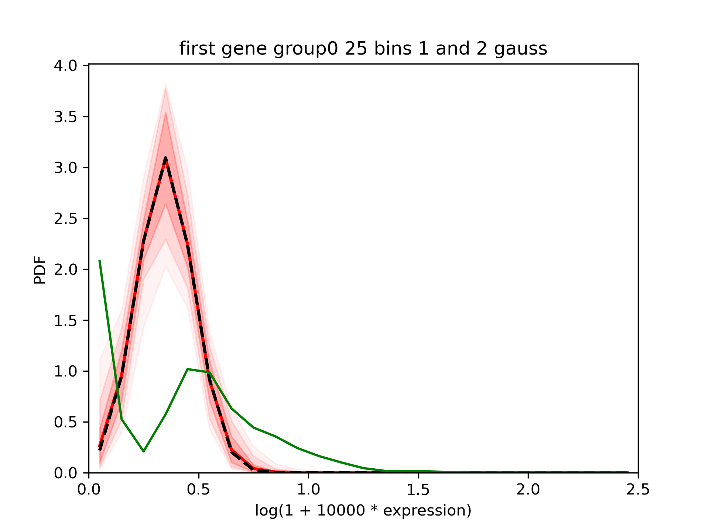
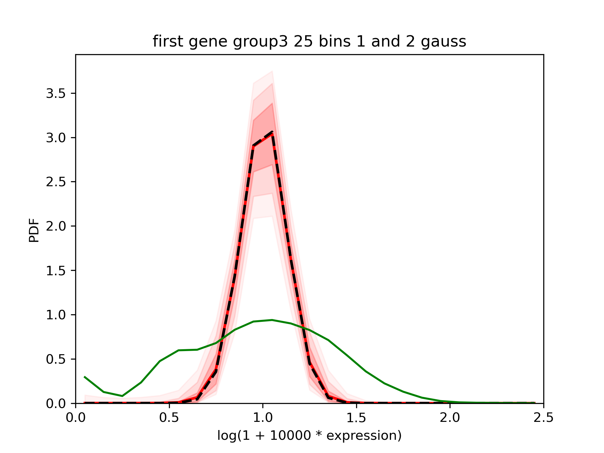
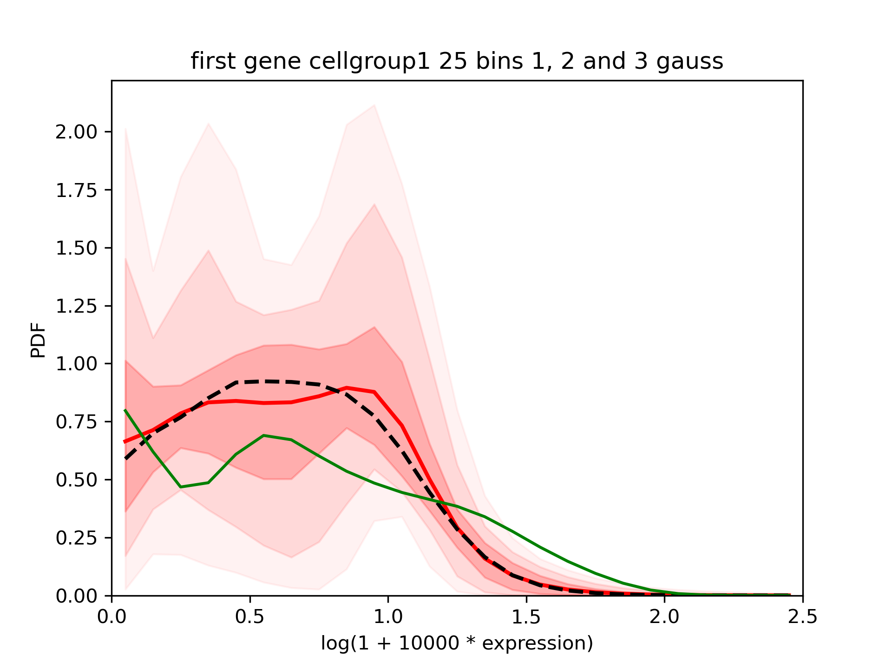
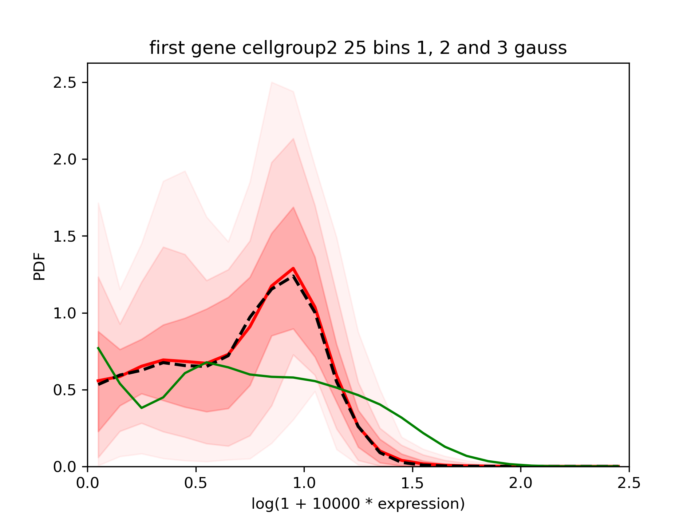

Compare means from baredSC results
==================================

.. contents:: 
    :local:

baredSC outputs can be used to evaluate the fold-change of expression between 2 conditions.

Inputs
------

We use the same inputs as in :ref:`previous input descriptions<Input desc>`.

Run baredSC on each subpopulation
---------------------------------

Let's focus on cells of group 0.0 and group 3.0 (they correspond to each of the 2 gaussians found previously).
To increase the speed we will use less bins (``--nx 25``):

.. code:: bash

    $ for group in 0 3; do
        for nnorm in 1 2; do
          baredSC_1d \
            --input example/nih3t3_generated_2d_2.txt \
            --metadata1ColName 0.5_0_0_0.5_group \
            --metadata1Values ${group}.0 \
            --geneColName 0.5_0_0_0.5_x \
            --output example/first_example_1d_group${group}_${nnorm}gauss_25_neff200 \
            --nnorm ${nnorm} --nx 25 --minNeff 200 \
            --figure example/first_example_1d_group${group}_${nnorm}gauss_25_neff200.png \
            --title "first gene ${nnorm} gauss group${group} 25 bins neff200" \
            --logevidence example/first_example_1d_group${group}_${nnorm}gauss_25_neff200_logevid.txt
        done
        combineMultipleModels_1d \
          --input example/nih3t3_generated_2d_2.txt \
          --metadata1ColName 0.5_0_0_0.5_group \
          --metadata1Values ${group}.0 \
          --geneColName 0.5_0_0_0.5_x --nx 25 \
          --outputs example/first_example_1d_group${group}_1gauss_25_neff200 \
          example/first_example_1d_group${group}_2gauss_25_neff200 \
          --figure example/first_example_1d_group${group}_1-2gauss_25.png \
          --title "first gene group$group 25 bins 1 and 2 gauss"
      done

In one case, 100 000 samples were not sufficient.

We check the QC. We can now compare the results:

We can see that the tool fits relatively nicely the gaussians which were in inputs.

If we use another metadata which is just 300 and 500 random cells:

.. code:: bash

    $ for group in 1 2; do
        for nnorm in 1 2 3; do
          baredSC_1d \
            --input example/nih3t3_generated_2d_2.txt \
            --metadata1ColName group \
            --metadata1Values group${group} \
            --geneColName 0.5_0_0_0.5_x \
            --output example/first_example_1d_cellgroup${group}_${nnorm}gauss_25_neff200 \
            --nnorm ${nnorm} --nx 25 --minNeff 200 \
            --figure example/first_example_1d_cellgroup${group}_${nnorm}gauss_25_neff200.png \
            --title "first gene ${nnorm} gauss cellgroup${group}" \
            --logevidence example/first_example_1d_cellgroup${group}_${nnorm}gauss_25_neff200_logevid.txt
        done
        combineMultipleModels_1d \
          --input example/nih3t3_generated_2d_2.txt \
          --metadata1ColName group \
          --metadata1Values group${group} \
          --geneColName 0.5_0_0_0.5_x --nx 25 \
          --outputs example/first_example_1d_cellgroup${group}_1gauss_25_neff200 \
          example/first_example_1d_cellgroup${group}_2gauss_25_neff200 \
          example/first_example_1d_cellgroup${group}_3gauss_25_neff200 \
          --figure example/first_example_1d_cellgroup${group}_1-3gauss_25.png \
          --title "first gene cellgroup$group 25 bins 1, 2 and 3 gauss"
      done

We see that the results are different in both groups but in both cases the confidence interval is quite large:

One of the output is `*_means.txt.gz`. Each line correspond to the value of the mean expression evaluated at each sample of the MCMC.
It can be used to estimate:

* A confidence interval on the mean value (in the used axis log(1 + 10^4 * expression))
* A confidence interval on the fold change (delogged).

.. ipython::

    In [1]: import numpy as np
       ...: def delog(x):
       ...:     return(1e-4 * (np.exp(x) - 1))
       ...: my_quantiles = [0.5 - 0.6827 / 2, 0.5, 0.5 + 0.6827 / 2]
       ...: # Get data
       ...: means1 = np.genfromtxt('../example/first_example_1d_group0_1-2gauss_25_means.txt.gz')
       ...: print(f'Values of mean in group0: {means1}')
       ...: means2 = np.genfromtxt('../example/first_example_1d_group3_1-2gauss_25_means.txt.gz')
       ...: print(f'Values of mean in group3: {means2}')
       ...: # Shuffle means2
       ...: np.random.shuffle(means2)
       ...: print(f'Mean log expression in group0: {np.quantile(means1, my_quantiles)}')
       ...: print(f'Mean log expression in group3: {np.quantile(means2, my_quantiles)}')
       ...: fc = [delog(x1) / delog(x2) for x1, x2 in zip(means1, means2)]
       ...: print(f'Estimation of fold-change: {np.quantile(fc,  my_quantiles)}')

We can use matplotlib to display the results graphically:

.. ipython::    

    @savefig fc_group.png
    In [2]: import matplotlib.pyplot as plt
       ...: x1, x2 = np.random.normal(1, 0.1, len(means1)), np.random.normal(3, 0.1, len(means2))
       ...: fig, axs = plt.subplots(1, 2)
       ...: axs[0].scatter(x1, means1, s=1, alpha=0.01)
       ...: axs[0].scatter(x2, means2, s=1, alpha=0.01)
       ...: axs[0].set_ylim(0, )
       ...: axs[0].set_ylabel('log(1 + expression * 10\'000)')
       ...: axs[0].set_xticks([1, 3])
       ...: axs[0].set_xticklabels(['group0', 'group3'], fontsize='x-large')
       ...: axs[1].scatter(x1[:len(fc)], fc, s=1, alpha=0.01)
       ...: axs[1].set_xticks([1])
       ...: axs[1].set_xticklabels(['fold-change'], fontsize='x-large')
       ...: axs[1].set_ylim(0, )
       ...: axs[1].set_ylabel('Fold-change (not log transformed)')
       ...: fig.tight_layout()

On the first example with group0 and group3 where each is a different gaussian, we see a mean log expression around the expected 0.375 value in group 0, 1 in group 3.
We see that the fold-change is around 25% (this is the real fold-change, not log transformed).

Now if we have a look to the subsamples of cells (300 and 500 cells) and perform the same analysis:

.. ipython::

    In [1]: # Get data
       ...: means1 = np.genfromtxt('../example/first_example_1d_cellgroup1_1-3gauss_25_means.txt.gz')
       ...: print(f'Values of mean in cellgroup1: {means1}')
       ...: means2 = np.genfromtxt('../example/first_example_1d_cellgroup2_1-3gauss_25_means.txt.gz')
       ...: print(f'Values of mean in cellgroup2: {means2}')
       ...: # Shuffle means2
       ...: np.random.shuffle(means2)
       ...: print(f'Mean log expression in cellgroup1: {np.quantile(means1, my_quantiles)}')
       ...: print(f'Mean log expression in cellgroup2: {np.quantile(means2, my_quantiles)}')
       ...: fc = [delog(x1) / delog(x2) for x1, x2 in zip(means1, means2)]
       ...: print(f'Estimation of fold-change: {np.quantile(fc,  my_quantiles)}')

.. ipython::    

    @savefig fc_cellgroup.png
    In [2]: x1, x2 = np.random.normal(1, 0.1, len(means1)), np.random.normal(3, 0.1, len(means2))
       ...: fig, axs = plt.subplots(1, 2)
       ...: axs[0].scatter(x1, means1, s=1, alpha=0.01)
       ...: axs[0].scatter(x2, means2, s=1, alpha=0.01)
       ...: axs[0].set_ylim(0, )
       ...: axs[0].set_ylabel('log(1 + expression * 10\'000)')
       ...: axs[0].set_xticks([1, 3])
       ...: axs[0].set_xticklabels(['cellgroup1', 'cellgroup2'], fontsize='x-large')
       ...: axs[1].scatter(x1[:len(fc)], fc, s=1, alpha=0.01)
       ...: axs[1].set_xticks([1])
       ...: axs[1].set_xticklabels(['fold-change'], fontsize='x-large')
       ...: axs[1].set_ylim(0, )
       ...: axs[1].set_ylabel('Fold-change (not log transformed)')
       ...: fig.tight_layout()

Here, we can see that the fold-change is slightly below 1.
