Run baredSC_1d with default parameters
======================================

.. contents:: 
    :local:

We will describe here an example step by step on simulated data where we will use default parameters and carefully check the QC.

.. _Input desc:

Inputs
------

We took total UMI counts from a real dataset of NIH3T3.
We generated a example where 2 genes have the same distribution (2 gaussians, one of mean 0.375, scale 0.125 and another one of mean 1 and scale 0.1).
Half of cells goes in each gaussian.
The gene is called "0.5_0_0_0.5_x".
The input table can be downloaded from `here <https://raw.githubusercontent.com/lldelisle/baredSC/master/tests/test_data/nih3t3_generated_2d_2.txt>`_.

Run
---

Run 1 gaussian
^^^^^^^^^^^^^^

Let say we don't know the number of gaussian, we try one.
We keep the default parameters and we set ``--figure`` to get visual outputs:

.. code:: bash

    $ baredSC_1d \
        --input baredSC/tests/test_data/nih3t3_generated_2d_2.txt \
        --geneColName 0.5_0_0_0.5_x \
        --output example/first_example_1d_1gauss \
        --nnorm 1 \
        --figure example/first_example_1d_1gauss.png \
        --title "first gene 1 gauss" \
        --logevidence example/first_example_1d_1gauss_logevid.txt

Check QC
^^^^^^^^

We first check the convergence:

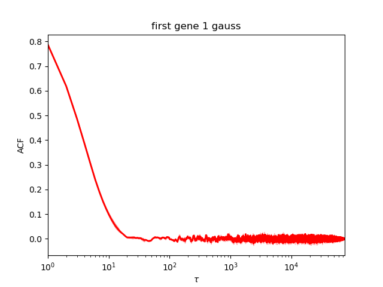

This plot show the autocorrelation as a function of number of samples.
The earlier the curves goes close to 0, the more it converged.

Here, this is perfect.

As printed during the run (or reading the file \*neff.txt), the Neff is around 8000 which is enough to estimate the confidence interval.

We have a look at the corner plot:

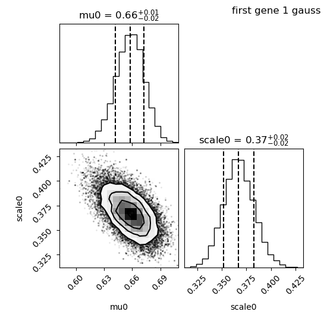

We see that the distribution of each parameter is close to gaussian, this is perfect.

We have a look at the parameter plot:

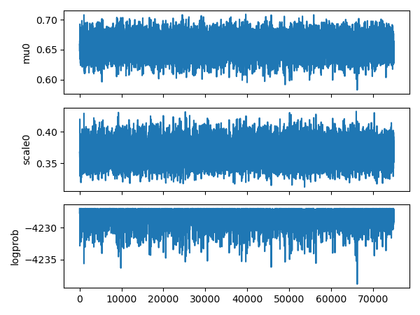

It nicely shows that the 2 parameters (mu0 and scale0) oscilate around the mean position while the log probability oscilate with a maximum value.

Look at the results
^^^^^^^^^^^^^^^^^^^

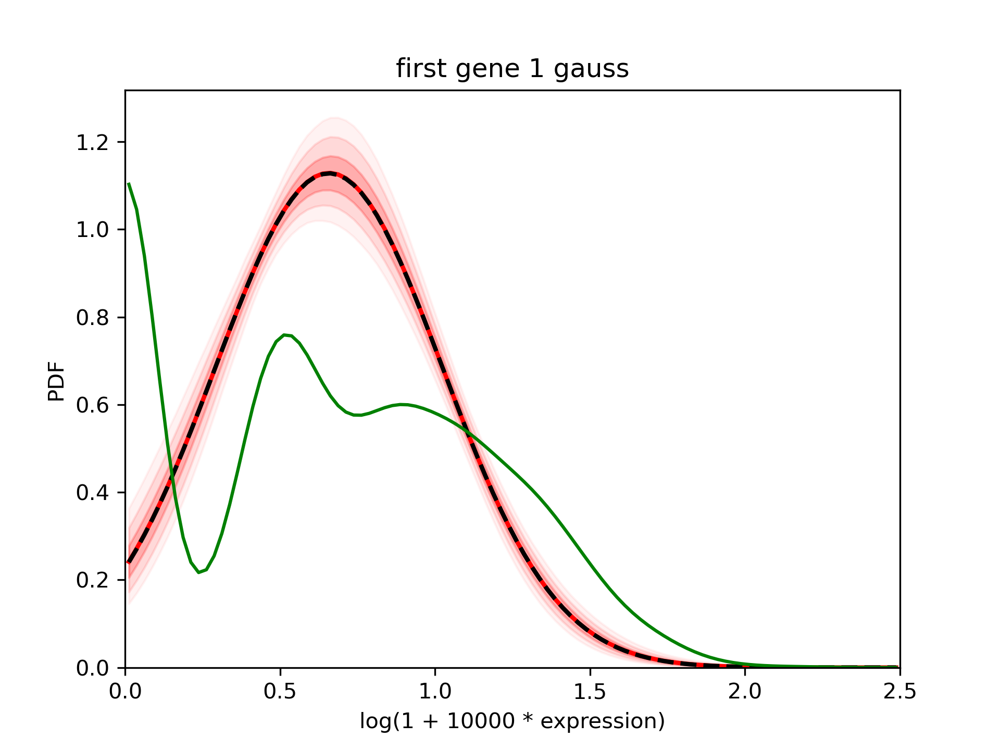

The pdf is well constrained (the shaded areas indicating the 68%, 95% and 99% interval are thin).
The mean in red is really close to the median in dashed black line.
However, using the green curve which is the density of the detected expression, we suspect that there are 2 gaussians.

Run 2 gaussians
^^^^^^^^^^^^^^^

Now let's try 2 gaussians

.. code:: bash

    $ baredSC_1d \
        --input baredSC/tests/test_data/nih3t3_generated_2d_2.txt \
        --geneColName 0.5_0_0_0.5_x \
        --output example/first_example_1d_2gauss \
        --nnorm 2 \
        --figure example/first_example_1d_2gauss.png \
        --title "first gene 2 gauss" \
        --logevidence example/first_example_1d_2gauss_logevid.txt

Check QC
^^^^^^^^

We first check the convergence:

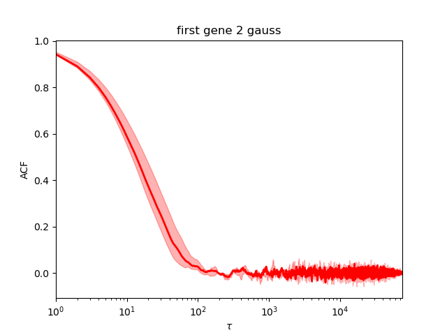

This is perfect.

As printed during the run (or reading the file \*neff.txt), the Neff is around 1300, perfect.

We have a look at the corner plot:

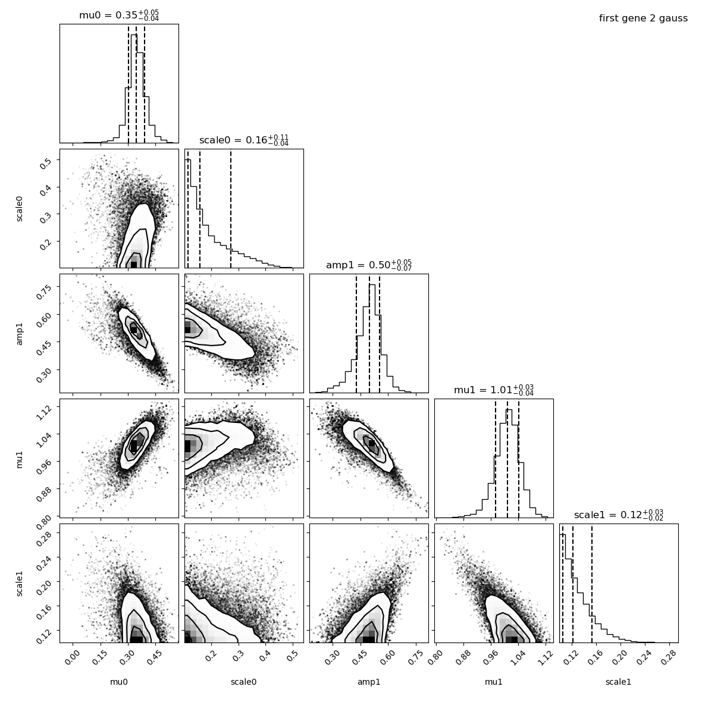

The means and amplitude are like a gaussian.
The scale distribution is asymetric because by default,
the minimum scale is set to 0.1 which is close to our values here.
Some parameters are correlated: the mean of the first Gaussian with the mean of the second Gaussian.
Some are anti-correlated: the mean of the second Gaussian with its amplitude.
But this is not problematic, just an information we can get from this plot.

We have a look at the parameter plot:

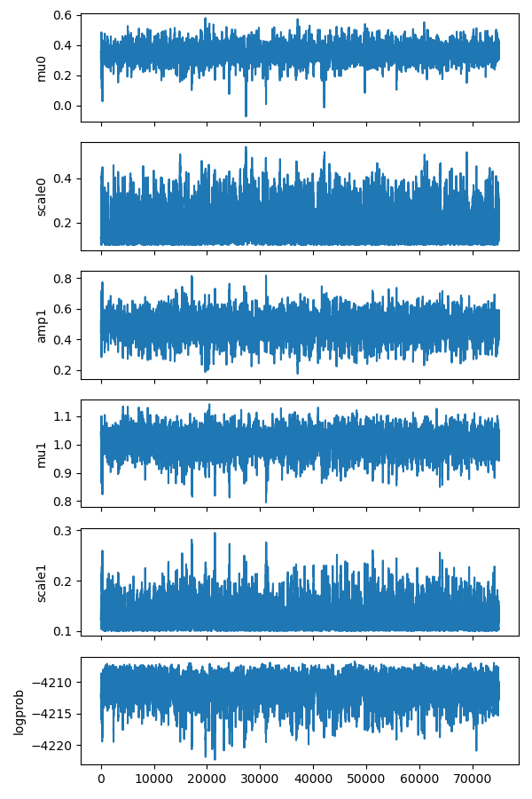

It nicely shows that the 5 parameters oscilate around the mean position and the log probability is quite constant.

Look at the results
^^^^^^^^^^^^^^^^^^^

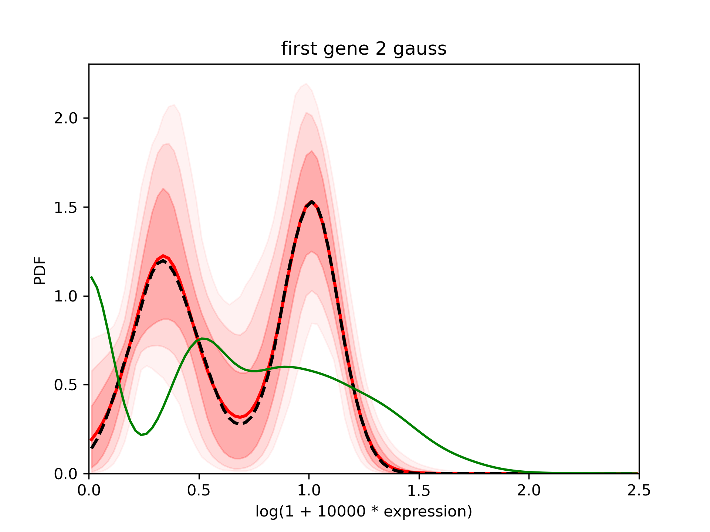

The confidence interval is larger than in the first case but still good.

Run 3 gaussians
^^^^^^^^^^^^^^^

Now let's try 3 gaussians

.. code:: bash

    $ baredSC_1d \
        --input baredSC/tests/test_data/nih3t3_generated_2d_2.txt \
        --geneColName 0.5_0_0_0.5_x \
        --output example/first_example_1d_3gauss \
        --nnorm 3 \
        --figure example/first_example_1d_3gauss.png \
        --title "first gene 3 gauss" \
        --logevidence example/first_example_1d_3gauss_logevid.txt

Check QC
^^^^^^^^

We first check the convergence:

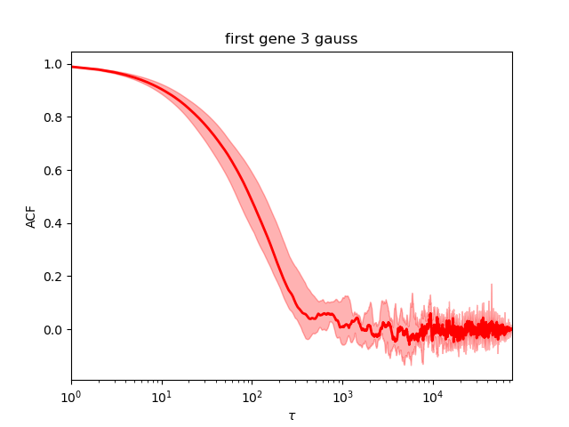

It is much worse than the first ones. The auto-correlation decreases later and does not stay a flat line at 0 but oscillate.

As printed during the run, the Neff is around 191. This is better to get more indenpendent samples.
We can rerun with another value of the seed but it is safer to rerun with increased number of samples.

We still have a look at the corner plot:

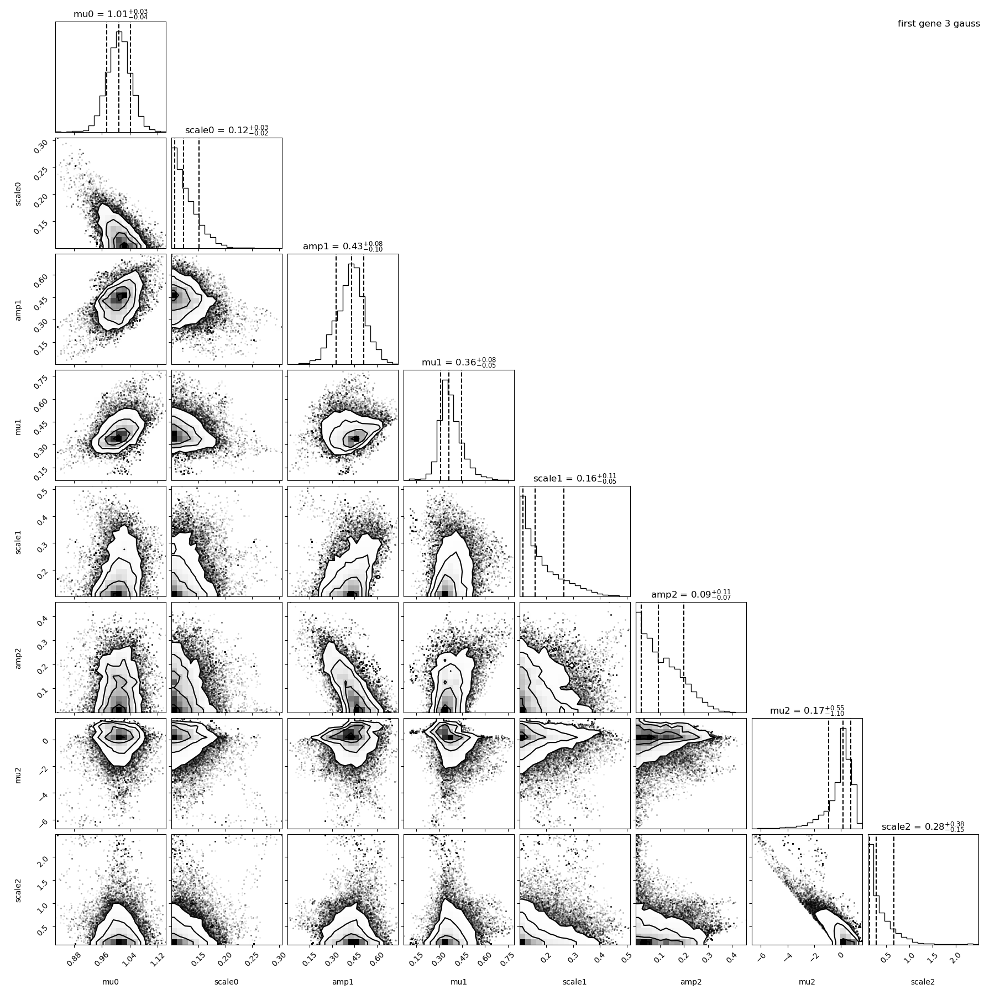

The first two Gaussians are close to what was expected. The third Gaussian is a Gaussian with a reduced mean (0.17 in average). We see that this last Gaussian is not very well constrained (large error bar on each of its parameters).

Look at the results
^^^^^^^^^^^^^^^^^^^

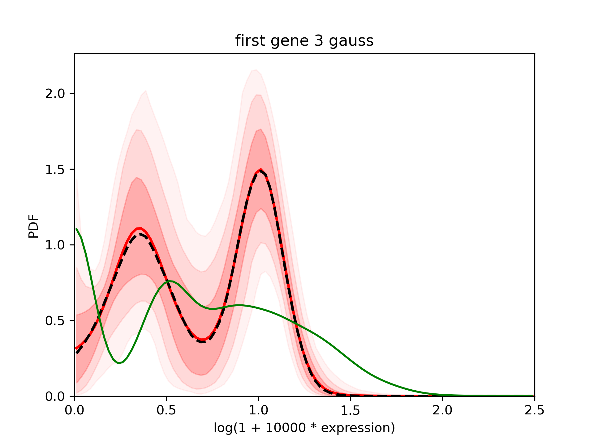

The results are very close to the one with 2 Gaussians.

Rerun 3 gauss with more samples
^^^^^^^^^^^^^^^^^^^^^^^^^^^^^^^
.. code:: bash

    $ baredSC_1d \
        --input baredSC/tests/test_data/nih3t3_generated_2d_2.txt \
        --geneColName 0.5_0_0_0.5_x \
        --output example/first_example_1d_3gauss_1M \
        --nnorm 3 --nsampMCMC 1000000 \
        --figure example/first_example_1d_3gauss_1M.png \
        --title "first gene 3 gauss 1M" \
        --logevidence example/first_example_1d_3gauss_1M_logevid.txt

It converged:

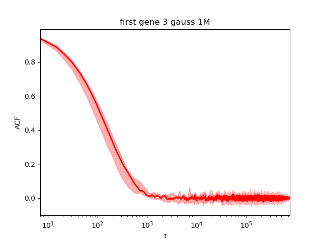

Automatic rerun when Neff is too small
^^^^^^^^^^^^^^^^^^^^^^^^^^^^^^^^^^^^^^

While some models converge even with a small number of samples,
some other needs a lot of sample to reach acceptable covergence.
A way to automatically rerun the MCMC when the effectif number of samples is too low
is to use the ``--minNeff``.
The MCMC will be rerun with 10 times more sample until
it reaches the value.
This can potentially take forever
as some model may never converge. But can be useful in other cases.
Even with this option, we highly encourage the users to manually check the QC.

Compare models
^^^^^^^^^^^^^^

In order to compare models, we will use the values of logevidence.

========== =============
model      log evidence 
========== =============
**1gauss** -4233.7
**2gauss** -4221.8
**3gauss** -4223.0
========== =============

We can see that the model with the highest log evidence is the model with 2 gaussians.
However, we see that the model with 3 gaussians is very close.
When you compare models, what is important is the difference between the log evidence, not its absolute value.

We can either choose the best model or decide to combine them:

Combine models
^^^^^^^^^^^^^^

Another way to use these models is to use samples from all models but using the log evidence to put weight on the number of sample to use from each model.

.. code:: bash

    $ combineMultipleModels_1d \
        --input baredSC/tests/test_data/nih3t3_generated_2d_2.txt \
        --geneColName 0.5_0_0_0.5_x \
        --outputs example/first_example_1d_1gauss \
        example/first_example_1d_2gauss \
        example/first_example_1d_3gauss_1M \
        --figure example/first_example_1d_1-3gauss.png \
        --title "first gene 1, 2, and 3 gauss"

In the standard output you will see that it only integrates samples from the 2gauss and 3gauss.
Here is the result:

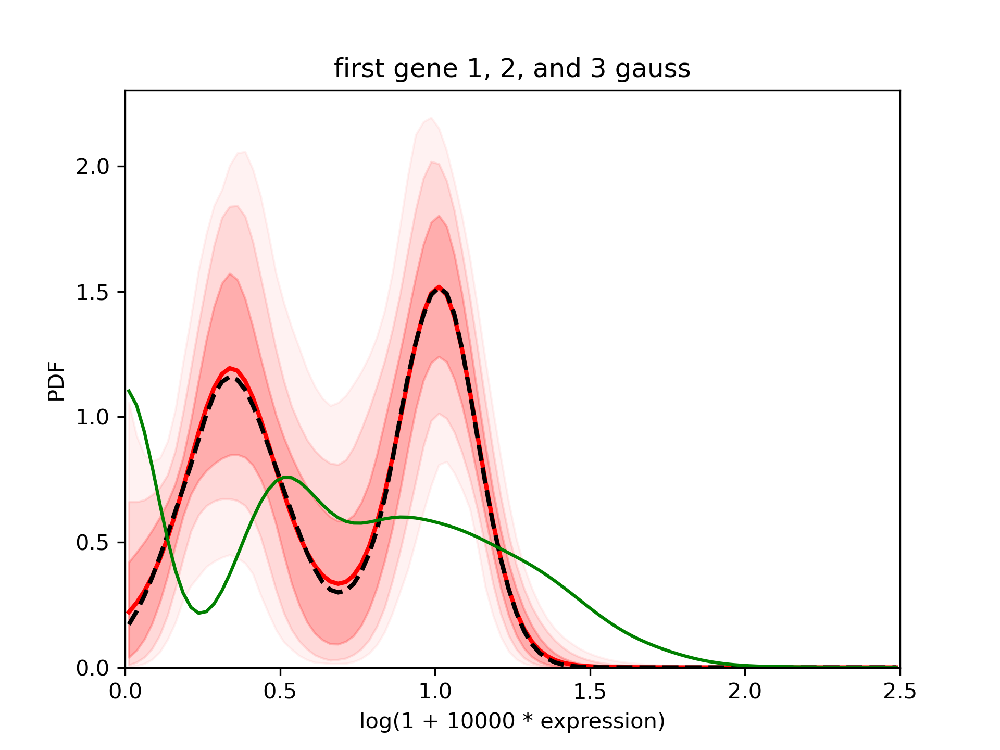
