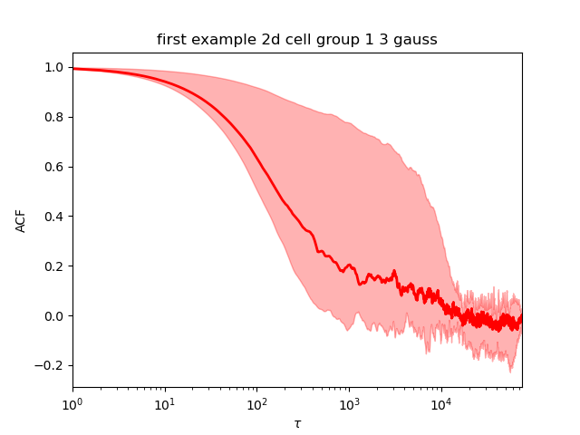
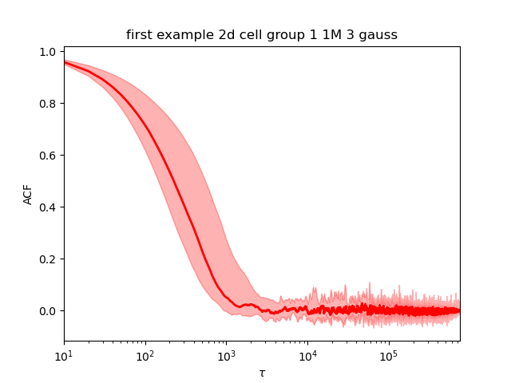
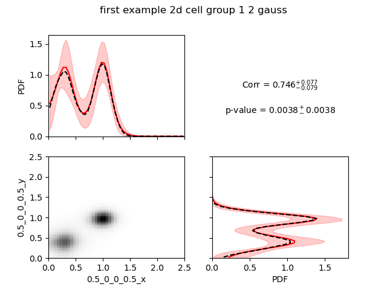
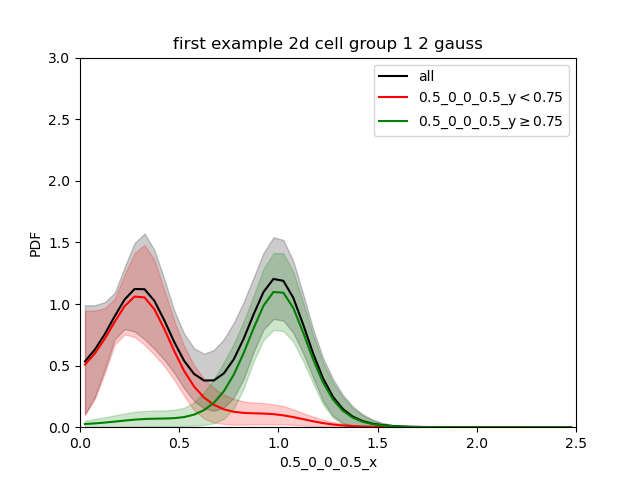
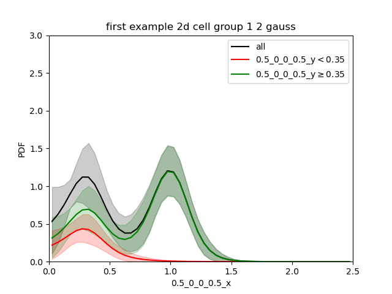
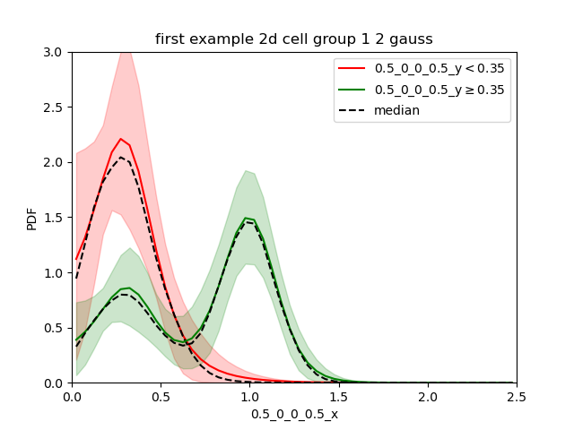
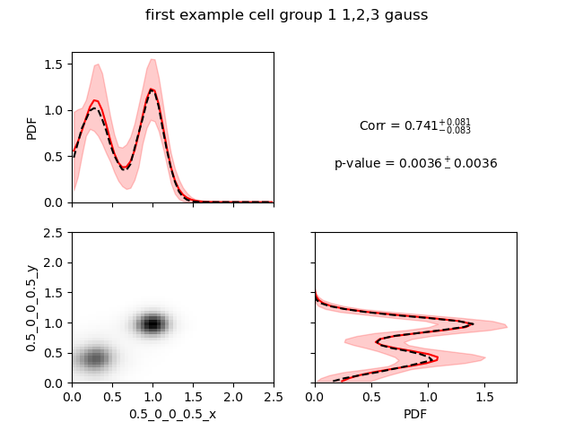

Run baredSC_2d with default parameters
======================================

.. contents:: 
    :local:

Inputs
------

We took total UMI counts from a real dataset of NIH3T3.
We generated a example where 2 genes have the same distribution
(2 gaussians, one of mean 0.375, scale 0.125 and another one of mean 1 and scale 0.1).
For each gene, half of cells goes in each gaussian.
The genes are called "0.5_0_0_0.5_x" and "0.5_0_0_0.5_y".
The input table can be downloaded from `here <https://raw.githubusercontent.com/lldelisle/baredSC/master/example/nih3t3_generated_2d_2.txt>`_.

2d
--

As for the 1d, you need to run it with different number of gaussian 2d to find the best model or to mix them.
The 2d tool is much slower than the 1d.
The time depends on the ``--nx``, ``--ny``, ``--osampxpdf``, ``--osampypdf`` parameters and the number of cells.
To make the example quicker we will run only on the 300 random cells (group1).

.. code:: bash

    $ for nnorm in 1 2 3; do
        baredSC_2d \
          --input example/nih3t3_generated_2d_2.txt \
          --geneXColName 0.5_0_0_0.5_x \
          --geneYColName 0.5_0_0_0.5_y \
          --metadata1ColName group \
          --metadata1Values group1 \
          --output example/first_example_2d_cellgroup1_${nnorm}gauss \
          --nnorm ${nnorm} \
          --figure example/first_example_2d_cellgroup1_${nnorm}gauss.png \
          --title "first example 2d cell group 1 ${nnorm} gauss" \
          --logevidence example/first_example_cellgroup1_2d_${nnorm}gauss_logevid.txt
      done

The QC are done the same way as the 1d. The models with 1 and 2 gaussians are converging.
The model with 3 gaussian is not converging (picture below left). When we rerun it with 1 million samples, it now converges (picture below right).

The best model (using the log evidence) is the 2 gaussians model.

We see a very high correlation highly significant. Here, we would like to warn the users that the correlation calculated here is a Pearson correlation, so it reflects how much the data are close to a line with positive or negative slope.

In order to appreciate the confidence interval it can be useful to split the 2d pdf in 2 parts: one above a threshold for y and one below the same threshold.
This is for this purpose that we can use ``--splity``.
For the demo we will try different values:

.. code:: bash

    $ baredSC_2d \
        --input example/nih3t3_generated_2d_2.txt \
        --geneXColName 0.5_0_0_0.5_x \
        --geneYColName 0.5_0_0_0.5_y \
        --metadata1ColName group \
        --metadata1Values group1 \
        --output example/first_example_2d_cellgroup1_2gauss \
        --nnorm 2 \
        --figure example/first_example_2d_cellgroup1_2gauss.png \
        --title "first example 2d cell group 1 2 gauss" \
        --splity 0.35 0.75

As the MCMC was run previously, it will use the ``.npz`` output to generate the figures, thus this operation is really quick.

When we split at 0.75 (between the 2 gaussian):

We find each of the 2 gaussians in 1d and the confidence interval is quite small.

When we split in the low gaussian (0.35):

We see that the green curve is made of 2 gaussian. The sum of both the green and red curves is the black one.
This can make the comparison difficult. So the output ``renorm.extension`` is sometimes better.

Now we clearly see that in the cells with low expression of gene y all cells are low for gene x while for cells with relatively high expression of gene y, gene x is bimodal with a greater proportion in the second gaussian.

Similarly to the 1d, the option ``--minNeff`` is also implemented.

You can combine multiple models with ``combineMultipleModels_2d``. By default, no p-value will be evaluated for the correlation but you can use less samples to get a p-value with ``--getPVal``.

.. code:: bash

    $ combineMultipleModels_2d \
        --input example/nih3t3_generated_2d_2.txt \
        --geneXColName 0.5_0_0_0.5_x \
        --geneYColName 0.5_0_0_0.5_y \
        --metadata1ColName group \
        --metadata1Values group1 \
        --outputs example/first_example_2d_cellgroup1_1gauss \
        example/first_example_2d_cellgroup1_2gauss \
        example/first_example_2d_cellgroup1_1M_3gauss \
        --figure example/first_example_2d_cellgroup1_1-3gauss.png \
        --getPVal \
        --title "first example cell group 1 1,2,3 gauss"

The lines printed indicates that it uses only 282 independent samples (1 from the 1 Gaussian model, 264 from the 2 Gaussians model and 15 from the 3 Gaussians model).

